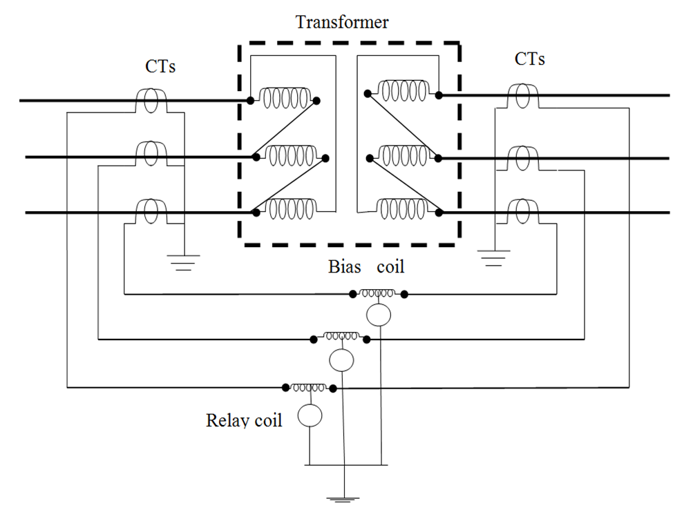

## Procedure

1. Switch ON CB for input supply
2. Press the start button.
3. Note the current flowing in the three phases in normal mode
4. Create a single phase to ground fault by pressing button F1.
5. Observe that the input current in one phase is greater than remaining two phases.
6. The differential relay tripped the transformer supply and LED indicator glows for single phasing fault.
7. Reset the relay by pressing reset button.
8. Repeat the process for other faults.

## Observations 

It is observed that when any fault takes place in the protected zone (i.e., between two CTs of the same line), the differential current flows in the relay coil and energizes it. The relay gives a trip signal to the circuit breaker to disconnect the transformer from the circuit.

## Connection Diagram 

**Fig. 10.1: Circuit diagram of differential protection of transformer**

