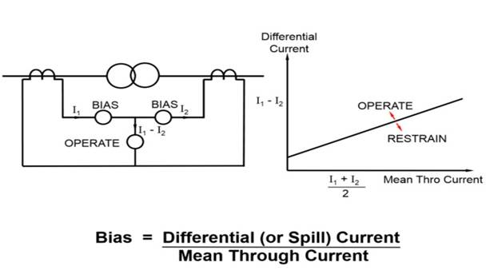
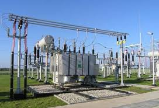
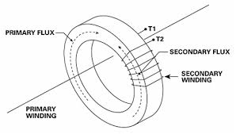
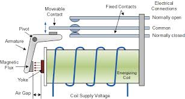

## Theory: Differential Protection

A transformer is a static device totally enclosed and generally oil-immersed. Thus, chances of fault occurrence on them are rare. However, consequences even so, could be very serious unless the transformer is quickly disconnected from the system.

Power transformers are classified as one of the most valuable equipment in a power system, hence their protection is of very high importance. The transformer differential protection provides fast tripping in case of a fault - before severe damage spreads out. Such faults are:

- Short circuits between turns, windings and cables inside the transformer housing
- Earth faults inside the housing
- Short circuits and earth faults outside the housing but within the protected zone (e.g. at bushings or supply lines)

  

*Diagram of Biased Differential Protection*

A differential relay is one that operates when the phase difference between the two or more similar electrical quantities exceeds a pre-determined value.

# Equipments Required 

  
| Equipment | Image |
| :---: | :---: |
| **Fig.1: Transformer** |  |
| **Fig.2: Current Transformer (CT)** |  |
| **Fig.3: Relay** |  |

